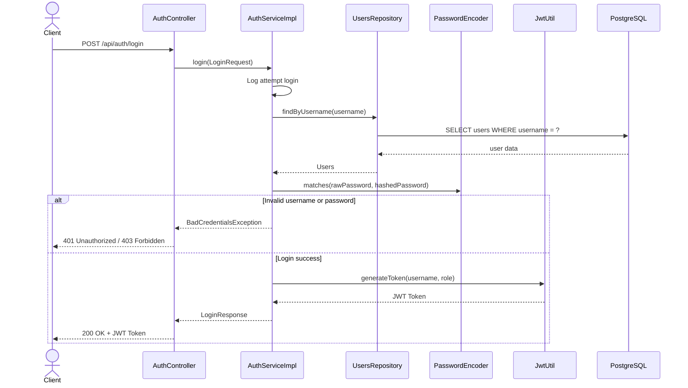
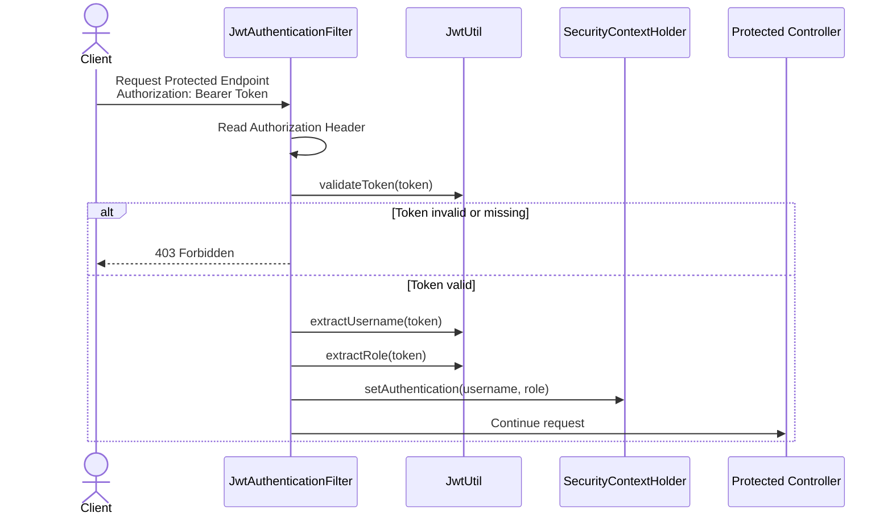
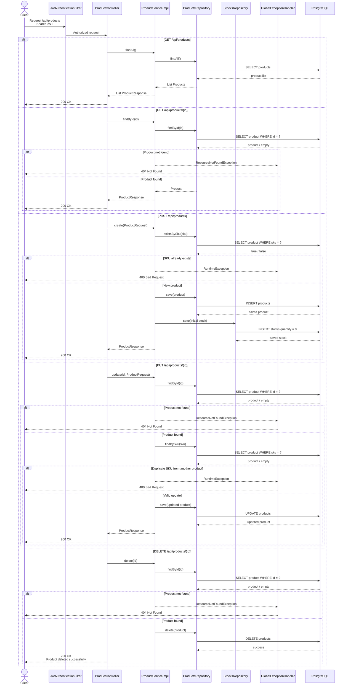
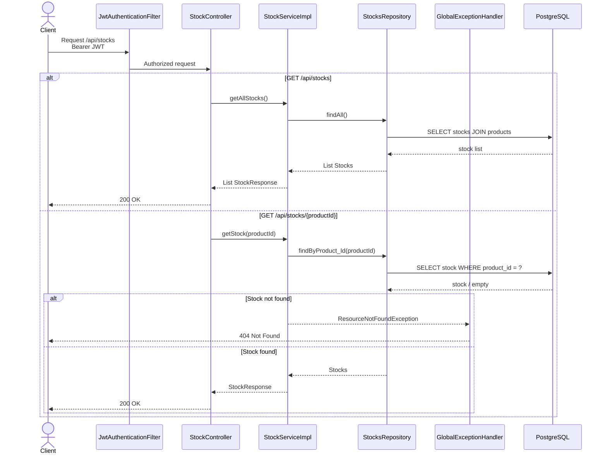
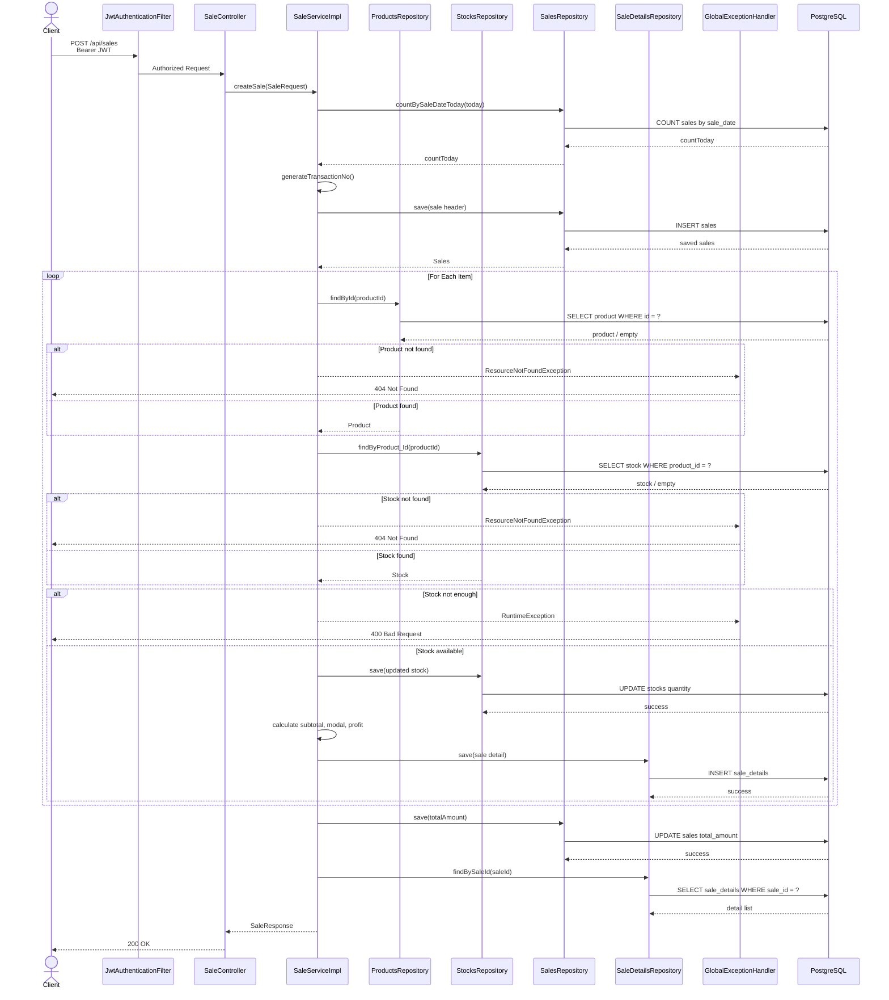
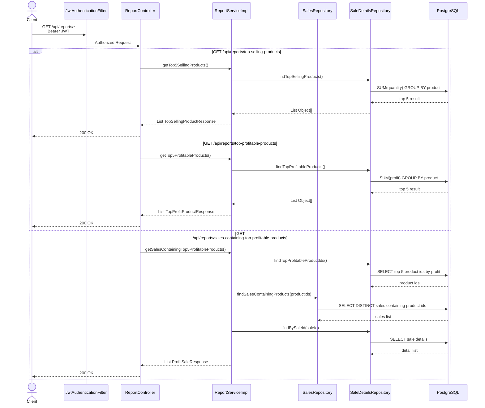

# Sequence Diagram

## Authentication & JWT Flow

---

## Protected Endpoint Flow

---

## Product Management Flow

---

## Stock Flow

---

## Sales Transaction Flow

---

## Report Generation Flow

