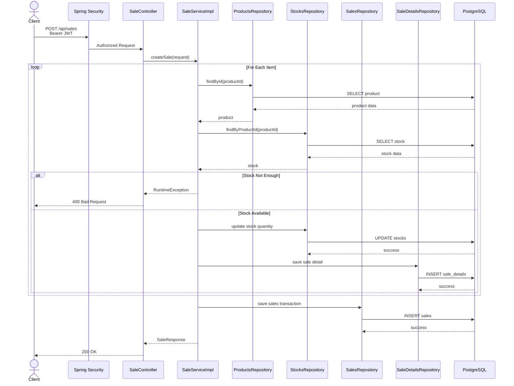
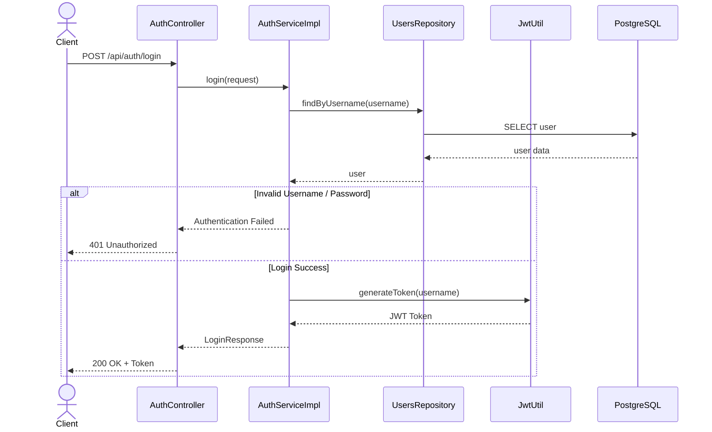
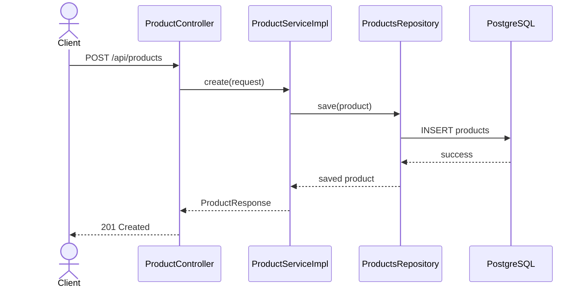
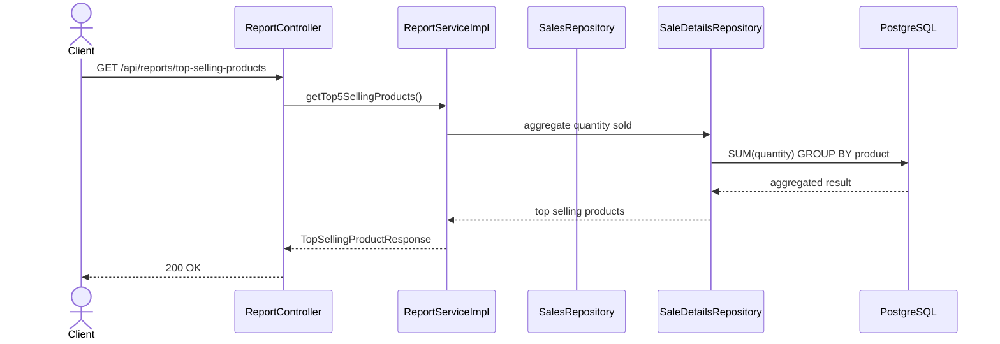

# Sequence Diagram

```mermaid
sequenceDiagram
    actor Client

    participant Security as Spring Security
    participant Controller as SaleController
    participant Service as SaleServiceImpl
    participant ProductRepo as ProductsRepository
    participant StockRepo as StocksRepository
    participant SalesRepo as SalesRepository
    participant DetailRepo as SaleDetailsRepository
    participant DB as PostgreSQL

    Client->>Security: POST /api/sales<br/>Bearer JWT

    Security->>Controller: Authorized Request
    Controller->>Service: createSale(request)

    loop For Each Item
        Service->>ProductRepo: findById(productId)
        ProductRepo->>DB: SELECT product
        DB-->>ProductRepo: product data
        ProductRepo-->>Service: product

        Service->>StockRepo: findByProductId(productId)
        StockRepo->>DB: SELECT stock
        DB-->>StockRepo: stock data
        StockRepo-->>Service: stock

        alt Stock Not Enough
            Service-->>Controller: RuntimeException
            Controller-->>Client: 400 Bad Request
        else Stock Available
            Service->>StockRepo: update stock quantity
            StockRepo->>DB: UPDATE stocks
            DB-->>StockRepo: success

            Service->>DetailRepo: save sale detail
            DetailRepo->>DB: INSERT sale_details
            DB-->>DetailRepo: success
        end
    end

    Service->>SalesRepo: save sales transaction
    SalesRepo->>DB: INSERT sales
    DB-->>SalesRepo: success

    Service-->>Controller: SaleResponse
    Controller-->>Client: 200 OK
```

---

## Login Flow

```mermaid
sequenceDiagram
    actor Client

    participant Controller as AuthController
    participant Service as AuthServiceImpl
    participant UserRepo as UsersRepository
    participant JWT as JwtUtil
    participant DB as PostgreSQL

    Client->>Controller: POST /api/auth/login

    Controller->>Service: login(request)

    Service->>UserRepo: findByUsername(username)
    UserRepo->>DB: SELECT user
    DB-->>UserRepo: user data
    UserRepo-->>Service: user

    alt Invalid Username / Password
        Service-->>Controller: Authentication Failed
        Controller-->>Client: 401 Unauthorized
    else Login Success
        Service->>JWT: generateToken(username)
        JWT-->>Service: JWT Token

        Service-->>Controller: LoginResponse
        Controller-->>Client: 200 OK + Token
    end
```

---

## Product Management Flow

```mermaid
sequenceDiagram
    actor Client

    participant Controller as ProductController
    participant Service as ProductServiceImpl
    participant Repository as ProductsRepository
    participant DB as PostgreSQL

    Client->>Controller: POST /api/products

    Controller->>Service: create(request)

    Service->>Repository: save(product)

    Repository->>DB: INSERT products
    DB-->>Repository: success

    Repository-->>Service: saved product

    Service-->>Controller: ProductResponse

    Controller-->>Client: 201 Created
```

---

## Report Generation Flow

```mermaid
sequenceDiagram
    actor Client

    participant Controller as ReportController
    participant Service as ReportServiceImpl
    participant SalesRepo as SalesRepository
    participant DetailRepo as SaleDetailsRepository
    participant DB as PostgreSQL

    Client->>Controller: GET /api/reports/top-selling-products

    Controller->>Service: getTop5SellingProducts()

    Service->>DetailRepo: aggregate quantity sold

    DetailRepo->>DB: SUM(quantity) GROUP BY product
    DB-->>DetailRepo: aggregated result

    DetailRepo-->>Service: top selling products

    Service-->>Controller: TopSellingProductResponse

    Controller-->>Client: 200 OK
```
